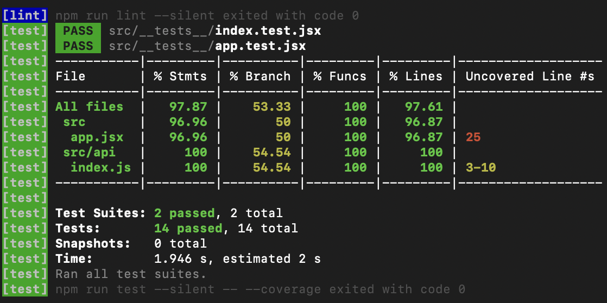

<!-- START doctoc generated TOC please keep comment here to allow auto update -->
<!-- DON'T EDIT THIS SECTION, INSTEAD RE-RUN doctoc TO UPDATE -->

- [Exercice de test d'intégration](#exercice-de-test-dint%C3%A9gration)
  - [Consignes](#consignes)
  - [Premier scénario : cas passant](#premier-sc%C3%A9nario--cas-passant)
    - [Second scénario : cas non passant](#second-sc%C3%A9nario--cas-non-passant)

<!-- END doctoc generated TOC please keep comment here to allow auto update -->

# Exercice de test d'intégration

Resultat test : 

## Consignes

Il faut créer un nouvel handler pour mocker l'api du submitForm. Pour le cas
d'erreur de l'api, elle devra renvoyer un objet { message : "les champs food et
drink sont obligatoires" } dans le cas où un des 2 champs est vide.

## Premier scénario : cas passant

1 - l'utilisateur est sur la Home

2 - Un titre "Welcome home" est dans le document

3 - Un lien "Fill out the form" est dans le document

4 - l'utilisateur clique sur le lien

5 - l'utilisateur est redirigé sur la page 1

6 - Un titre "Page 1" est dans le document

7 - un lien "Go home" est dans le document

8 - Un champ avec le label "Favorite food" est dans le document

9 - l'utilisateur rempli le champ avec "Les pâtes"

10 - un lien "Next" est dans le document

11 - l'utilisateur clique sur le lien "Next"

12- l'utilisateur est redirigé sur la page 2

13 - Un titre "Page 2" est dans le document

14 - un lien "Go back" est dans le document

15 - Un champ avec le label "Favorite drink" est dans le document

16 - l'utilisateur rempli le champ avec "Bière"

17 - un lien "Review" est dans document

18 - l'utilisateur clique sur le lien "Review"

19 - l'utilisateur est redirigé sur la page de confirmation

20 - Un titre "Confirm" est dans le document

21 - Un texte "Please confirm your choices" est dans le document

22 - Un texte label "favorite food" a pour contenu "Les pâtes"

23 - Un texte label "favorite drink" a pour contenu "Bière"

24 - un lien "Go back" est dans le document

25 - un bouton "Confirm" est dans le document

26 - l'utilisateur clique sur le bouton "Confirm"

27 - l'utilisateur est redirigé sur la page de Félicitation

28 - Un titre "Congrats.You did it." est dans le document

29 - un lien "Go home" est dans le document

30 - l'utilisateur clique sur le lien "Go Home"

31 - l'utilisateur est redirigé sur la home

32 - Un titre "Welcome home" est dans le document

### Second scénario : cas non passant

1 - l'utilisateur est sur la Home

2 - Un titre "Welcome home" est dans le document

3 - Un lien "Fill out the form" est dans le document

4 - l'utilisateur clique sur le lien

5 - l'utilisateur est redirigé sur la page 1

6 - Un titre "Page 1" est dans le document

7 - un lien "Go home" est dans le document

8 - Un champ avec le label "Favorite food" est dans le document

9 - l'utilisateur rempli le champ avec ""

10 - un lien "Next" est dans le document

11 - l'utilisateur clique sur le lien "Next"

12- l'utilisateur est redirigé sur la page 2

13 - Un titre "Page 2" est dans le document

14 - un lien "Go back" est dans le document

15 - Un champ avec le label "Favorite drink" est dans le document

16 - l'utilisateur rempli le champ avec "Bière"

17 - un lien "Review" est dans document

18 - l'utilisateur clique sur le lien 'Review'

19 - l'utilisateur est redirigé sur la page de confirmation

20 - Un titre "Confirm" est dans le document

21 - Un texte "Please confirm your choices" est dans le document

22 - Un texte label "favorite food" a pour contenu ""

23 - Un texte label "favorite drink" a pour contenu "Bière"

24 - un lien "Go back" est dans le document

25 - un bouton "Confirm" est dans le document

26 - l'utilisateur clique sur le bouton "Confirm"

27 - l'utilisateur est redirigé sur la page d'erreur

28 - Un texte "Oh no. There was an error." est dans le document

29 - Un texte "les champs food et drink sont obligatoires" est dans le document

30 - un lien "Go home" est dans le document

31 - un lien "Try again" est dans le document

32 - l'utilisateur clique sur le lien "Try again"

33 - l'utilisateur est redirigé sur la page 1

34 - Un titre "Page 1" est dans le document
